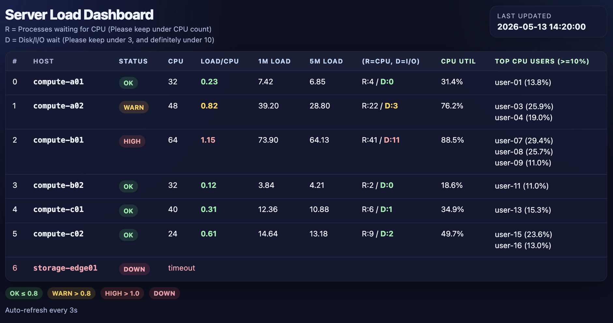

# serverloadstat-web

A lightweight web dashboard for monitoring Linux server load across multiple hosts.

`serverloadstat-web` polls your servers over SSH, collects load average and process CPU usage, and serves a simple auto-refreshing dashboard.

It is intentionally small: no database, no frontend build step, no Python package install required.



## Reading the Dashboard

- `Load/CPU`: 1-minute load average divided by CPU count
- `R`: processes currently runnable or waiting for CPU
- `D`: processes in uninterruptible sleep, usually disk or I/O wait
- `CPU Util`: summed process CPU usage divided by CPU count
- `Top CPU Users`: users above 10% CPU utilization

Default status thresholds:

- `OK`: Load/CPU <= 0.8
- `WARN`: Load/CPU > 0.8
- `HIGH`: Load/CPU > 1.0
- `DOWN`: SSH command failed or timed out

## Features

- Shows each host's CPU count, 1m/5m load average, and Load/CPU ratio
- Highlights OK, WARN, HIGH, and DOWN states
- Shows runnable process count (`R`) and I/O wait count (`D`)
- Shows top CPU users above a configurable threshold
- Can anonymize usernames with `--mask-users`
- Uses only the Python standard library

## Quick Start

### Preview with sample data

```bash
cd serverloadstat-web
mkdir -p data
cp sample_data/stat_data.json data/stat_data.json
python3 web_dashboard.py --port 4000
```

Open:

```text
http://localhost:4000
```

## Usage

### Monitor your own servers

Create a host list:

```bash
cp example-hosts.txt hosts.txt
```

Edit `hosts.txt`:

```text
compute-a01
compute-a02
compute-b01
```

Start the collector:

```bash
mkdir -p data
python3 collector.py --hosts-file hosts.txt
```

In another terminal, start the dashboard:

```bash
python3 web_dashboard.py --port 4000
```

To run both processes in the background with `nohup`:

```bash
pkill -f collector.py
pkill -f web_dashboard.py
nohup python3 collector.py --hosts-file hosts.txt > /tmp/serverloadstat-collector.log 2>&1 &
nohup python3 web_dashboard.py --port 4000 > /tmp/serverloadstat-web.log 2>&1 &
```

## Files

```text
serverloadstat-web/
├── collector.py                  # polls hosts over SSH and writes JSON
├── web_dashboard.py              # serves the HTML dashboard
├── example-hosts.txt             # example host list
├── sample_screenshot.png         # sample dashboard screenshot
├── sample_data/stat_data.json    # demo dashboard data
└── data/                         # default output directory
```

## Collector Options

```bash
python3 collector.py --help
```

- `hosts`: hosts to poll, passed as positional arguments
- `--hosts-file`: newline-delimited host list
- `--mask-users`: anonymize users by replacing usernames with `user-01`, `user-02`, ...

## Dashboard Options

```bash
python3 web_dashboard.py --help
```

- `--port`: HTTP port, default `4000`

## Troubleshooting

### Host shows `DOWN`

Check SSH access:

```bash
ssh compute-a01 hostname
```

The collector uses batch mode, so password prompts will fail. Use SSH keys or an existing SSH agent.

The collector also expects common Linux commands available on most servers:

```bash
ssh compute-a01 "cat /proc/loadavg; nproc; ps -eo user,pcpu,state --no-headers | head"
```

### Dashboard shows no data

Make sure the collector is writing to the same file that the dashboard reads:

```bash
python3 collector.py --hosts-file hosts.txt
python3 web_dashboard.py
```

### Usernames should not be visible

Run the collector with:

```bash
python3 collector.py --hosts-file hosts.txt --mask-users
```

## License

This project is licensed under the MIT License. See [LICENSE](LICENSE) for details.
